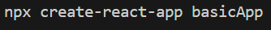
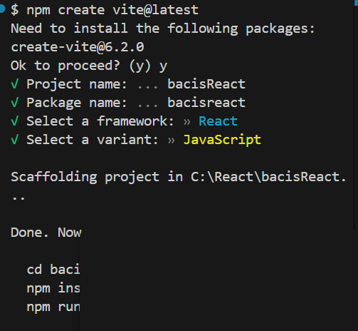
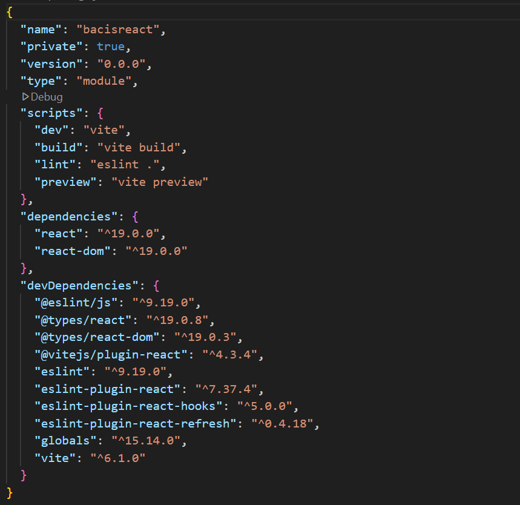
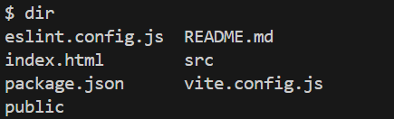
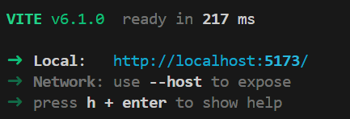

# Manual Of React Aap

# 1. npx Node package Executer
### diff between npm and npx
npm is (Node package manager) which install the package in our folder than use it. 
Here we have npx (Node package Executer) whcih directly use the package for development without instaling them

## how to make a project in React
### create project command  (slower)
use utility --> software --> ```npx create-react-app app-name```   (time consuming process)




### create project command using vite  (faster) 
utility --> sofware --> ```npm create vite@latest```




# 2. structure of React Project

#### A package.json (Entry point)
It give all details of our React project (Contain all information )




Script :- Inside package.json i have script  which is responsible to run the project in phases
To run the project than run start script
#### command
dir (Windows)



#### main command 
```npm run start``` mainly used in old version not used in vite


To run on latest versions 
1. Go to your folder using command ``` cd foldername(react folder) ```
2. install dependencies using ``` npm install``` or ```npm i```
3. Run command ``` npm run dev ``` to run react project mainly used in new version (vite)

After performing above steps you see a link of your project




Important!
 we can also run all script command using ```npm run command-name``` 

ls (Mac)


# How to push a code a Modified code on github 


1. ``` git status ```  
This will show the modified and new files that need to be committed.

To add all modified and new files:

2. ``` git add . ```

If you only want to add specific files, use:

3. ``` git add filename.ext ```

Commit the added files with a meaningful message:

4. ``` git commit -m "Updated feature XYZ" ```

Push the changes to your remote repository:

5. ``` git push origin main ```

If your branch is master, use:

6. ``` git push origin master ```
